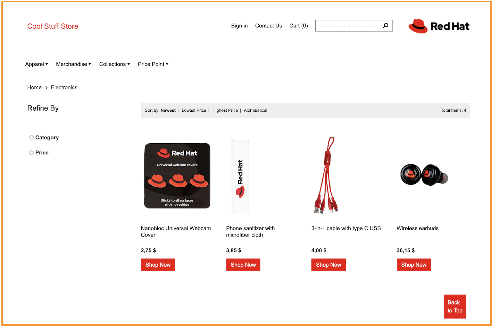
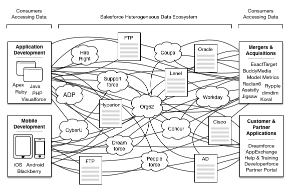

# Introduction
ACME App is a cloud native demo application. It's based on 5 microservices that communicate with each other to provide users a full e-commerce application. Users will be able to browse items, add them to the cart, and purchase them.

| Home Page                                                                                                         | Checkout Screen                                                                                                    |
| ----------------------------------------------------------------------------------------------------------------- | ------------------------------------------------------------------------------------------------------------------ |
|  |  |

| Service name | Language | Description |
|--|--|--|
| firstmicroservice | Java | Provide all CRUD action for an item|
| secondmicroservice | Nodejs | Entry point for ACME App. Expose an HTTP Server |

# Requirements
 - Openshift 4.5+ (Installed and configured)
 - oc cli 

# Setup
This paragraph is used to describe how to configure your machine or server to be able to launch the installation procedure. Setup can be different regarding which type of installation will be used.

# Installation

## Option 1 - Install on your machine

## Option 2 - Run on Openshift

## Option 3 (With SQL database)

## Option 4 - Lorem Ipsum

# Usage
Once installation is done, how users will interact with your apps ? This section will give all details about how to use this application.

# Cleanup
A demo can be simple to install but difficult to uninstall or clean the environment. To avoid this, your app should contains a cleaning script described in this section.

# Documentation
Documentation will be found in docs folder but it's interesting for non-redhat to point them in the right direction.

# Released versions
